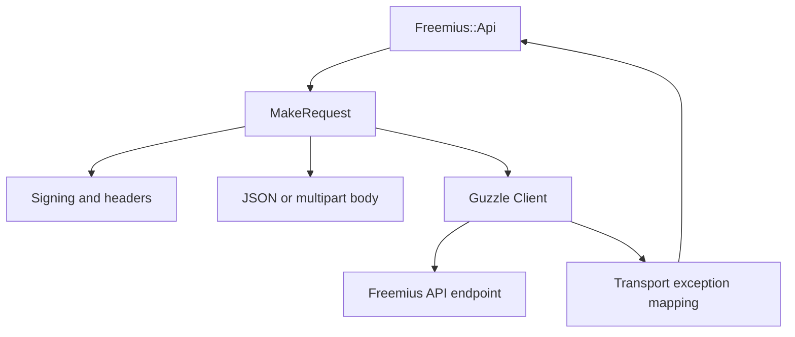

# Requirements

### Overview & Goals
- Create `freemius/Legacy/Freemius.php` as an immutable, autoloadable baseline copy of the current `Freemius` class before changing the production implementation.
- Replace direct CURL usage in `freemius/Freemius.php` with the already-declared Guzzle 6 client (`guzzlehttp/guzzle:^6.0`, locked to `6.5.8`).
- Preserve the SDK’s public API behavior, request signing, JSON responses, GET/DELETE query handling, JSON POST/PUT requests, multipart uploads, sandbox URLs, and `FreemiusException` result shape.
- Remove the SDK’s direct dependency on CURL APIs and make the Guzzle request configuration explicit rather than relying on CURL constants.

### Scope
#### In Scope
- Copy the current `freemius/Freemius.php` into `freemius/Legacy/Freemius.php`, place it under the `Freemius\SDK\Legacy` namespace, and make only the identity reference required for the copied class to load independently.
- Keep the legacy copy behaviorally identical, including its CURL options, signing, multipart boundary generation, and `MakeRequest()` cURL-handle extension point.
- Migrate `MakeRequest()` and its request setup/execution/error path in the active `Freemius` class.
- Replace the CURL option set around `Freemius.php:69-75` with named Guzzle request options.
- Adapt `SignRequest()` so it builds HTTP headers rather than mutating a CURL option array.
- Reproduce the current JSON, query-string, multipart, PUT-over-POST, timeout, user-agent, `Expect`, TLS, and IPv4 fallback behavior.
- Update Composer/runtime requirements and extend the existing credentialed test to run both the frozen legacy class and the Guzzle-backed class for comparison.

#### Out of Scope
- Any Guzzle, multipart, signing, or transport refactor inside `Freemius\SDK\Legacy\Freemius`; it is a frozen baseline after creation.
- Changes to Freemius API paths, authentication algorithms, endpoint payload contracts, or public API methods unrelated to HTTP transport.
- A separate TLS-security hardening change; the current `verify=false` behavior should be documented as a compatibility concern rather than silently changed during this refactor.

### Functional Requirements
- `GET` and `DELETE` parameters remain query parameters generated by `AddQueryParams()`.
- JSON `POST` and `PUT` requests retain the exact JSON body used for `Content-MD5` signing.
- Multipart requests retain the current upload fields, MIME types, original-method signing, and `PUT` behavior that sends `POST` with `method=PUT` in the query.
- HTTP error responses remain available to `ApiRequest()` as response bodies instead of being thrown automatically by the client.
- Transport failures continue to become `FreemiusException` instances with an error code, message, and transport error type.
- The default endpoint remains HTTPS-based without using `curl_version()`; explicit `FS_API__ADDRESS`/sandbox constants continue to work.

### Compatibility Requirements
- Publish the legacy baseline as `Freemius\SDK\Legacy\Freemius` without changing the public `Freemius\SDK\Freemius` entry point.
- Assess and document the migration impact of the public static `$CURL_OPTS` property and the optional CURL handle parameter on `MakeRequest()`; preserve both in the legacy snapshot for comparison.
- Preserve `MakeRequest()` as the overridable extension point where possible, while replacing CURL-specific customization with a Guzzle-options configuration/factory path.
- Keep the PHP `>=7.4` support floor and the existing Composer autoloading layout.

# Technical Design

### Current Implementation
- `freemius/Freemius.php` is the 641-line main class; its global setup is at lines 23–42 and its class declaration begins at line 44.
- `freemius/Freemius.php:30-37` requires the CURL extension and derives `FS_API__PROTOCOL` from `curl_version()`.
- `Freemius::$CURL_OPTS` at `freemius/Freemius.php:69-75` contains `CURLOPT_CONNECTTIMEOUT=10`, `CURLOPT_RETURNTRANSFER`, `CURLOPT_TIMEOUT=60`, `CURLOPT_USERAGENT`, and mutable HTTP headers.
- `SignRequest()` at approximately `freemius/Freemius.php:337-364` appends `Date`, `Authorization`, and optional `Content-MD5` headers to the CURL option array; `GenerateAuthorizationParams()` supplies the existing signing contract.
- `MakeRequest()` at approximately `freemius/Freemius.php:455-574` assembles query/JSON/multipart requests, sets CURL options, disables `Expect: 100-continue` and HTTPS verification, retries selected IPv6 connection failures using `CURL_IPRESOLVE_V4`, and throws `FreemiusException` on execution failure.
- `GenerateMultipartBody()` and `GetMimeContentType()` at approximately `freemius/Freemius.php:580-605` provide manual multipart encoding and MIME detection.
- `composer.json:12-17` already requires Guzzle 6 and `ext-curl`; `composer.lock:10-28` locks Guzzle to `6.5.8`.

### Key Decisions
- Create `freemius/Legacy/Freemius.php` first as a mechanical baseline copy; move it to the `Freemius\SDK\Legacy` namespace and rename only the copied class identity and its direct version reference, then do not use it as a refactor target.
- Have active `Freemius` own a lazily created concrete `GuzzleHttp\Client` through private `CreateHttpClient()`/accessor helpers; do not add a Guzzle dependency parameter to the public constructor, preserving the selected minimal public integration boundary.
- Replace CURL constants with a normalized Guzzle request-options configuration. Preserve existing externally visible behavior where feasible, but explicitly deprecate or document the CURL-specific `$CURL_OPTS` and `$ch` extension points because they cannot be passed to Guzzle unchanged.
- Set Guzzle `http_errors=false` and `allow_redirects=false` to avoid changing current response/error and redirect behavior through Guzzle defaults.
- Preserve the current signing inputs. JSON bodies are signed before dispatch; multipart requests use a Guzzle PSR-7 multipart stream with a known boundary so the signed `Content-Type` matches the wire request and the existing PUT method override remains intact.
- Represent the IPv4 recovery path with Guzzle’s `force_ip_resolve => 'v4'` retry option rather than parsing raw CURL error strings; translate all final transport failures to the SDK’s existing exception result structure.
- Keep `ext-curl` as a runtime requirement initially so Guzzle 6 can use its mature cURL handler and preserve the IPv4 fallback; removing the extension is a separate compatibility decision because Guzzle’s stream handler does not provide identical low-level behavior.

### Guzzle Integration Alternatives
 Approach | Pros | Cons | Decision |
 --- | --- | --- | --- |
 **Internal client with private factory** | Smallest public API change; keeps `Freemius` as the orchestration point; avoids exposing Guzzle types in the constructor. | Per-instance handler and middleware configuration is less explicit; custom callers lose direct access to the old CURL handle. | **Selected** for this compatibility-focused refactor. |
 **Constructor-injected `ClientInterface`** | Makes the transport dependency explicit; strongest unit-test isolation; callers can provide middleware, proxies, handlers, and timeouts per instance. | Changes the constructor contract or requires an additional optional parameter; exposes Guzzle’s interface as part of SDK integration; increases migration and documentation burden. | Not selected for the first migration. |
 **Dedicated transport adapter** | Separates signing/request construction from HTTP execution; creates a reusable seam for future clients and makes transport errors easier to isolate. | Broadens the refactor beyond replacing CURL; requires deciding which layer owns multipart bodies and signatures; creates another public or protected abstraction to support. | Suitable as a later architectural refactor, not required now. |

The selected approach has `Freemius` create and retain its internal Guzzle client on first use, while request execution depends on `ClientInterface` behavior rather than global helper functions. The client factory and transport helpers are private, so callers use the public API rather than replacing the internal transport.

### Guzzle Handler and Request-API Choices
- Use `ClientInterface::request()` with explicit per-request options. This maps directly from the existing `MakeRequest()` flow and makes method, URL, headers, body, timeout, TLS, redirect, and error behavior visible; using `send()` would require constructing a PSR-7 request earlier and adds no benefit for this SDK.
- Use `http_errors=false` and inspect the response body directly. This preserves the current behavior where HTTP error bodies reach `ApiRequest()`; enabling Guzzle exceptions for 4xx/5xx would change the existing `FreemiusException` boundary.
- Do not rely on Guzzle’s implicit multipart boundary generation. Generate one boundary per request, build a PSR-7 `MultipartStream` with that boundary, set the matching `Content-Type` header before signing, and pass the same stream through the request `body` option so the signed headers and wire body remain identical.
- Keep the default cURL-backed handler for production initially. Guzzle’s stream handler could remove the `ext-curl` requirement, but it has different support for IPv4 forcing, TLS details, and performance; this refactor should not combine that deployment change with the CURL API removal.
- Use `MockHandler` and history middleware in tests rather than live requests or a custom fake client. This validates the actual Guzzle request options and serialized body while remaining compatible with the internal factory choice.

### CURL-to-Guzzle Mapping
 Current CURL behavior | Guzzle representation |
 --- | --- |
 `CURLOPT_CONNECTTIMEOUT => 10` | `connect_timeout => 10` |
 `CURLOPT_TIMEOUT => 60` | `timeout => 60` |
 `CURLOPT_RETURNTRANSFER` | Read the PSR-7 response body; no direct option needed |
 `CURLOPT_USERAGENT` | `headers['User-Agent'] => FS_SDK__USER_AGENT` |
 `CURLOPT_HTTPHEADER` | `headers` array built from signing and content headers |
 `CURLOPT_URL` | URL passed to `Client::request()` |
 `CURLOPT_CUSTOMREQUEST` | HTTP method argument to `Client::request()` |
 `CURLOPT_POST` / `CURLOPT_POSTFIELDS` | `body` for JSON or a PSR-7 multipart body |
 `CURLOPT_SSL_VERIFYHOST=false` / `CURLOPT_SSL_VERIFYPEER=false` | `verify => false`, retained for compatibility and flagged for security follow-up |
 `Expect:` | `expect => false` or an equivalent empty `Expect` header |
 `CURL_IPRESOLVE_V4` retry | `force_ip_resolve => 'v4'` on the targeted retry |

### Proposed Changes
- Add Guzzle client and PSR-7 imports in `Freemius.php`; remove direct `curl_init()`, `curl_setopt_array()`, `curl_exec()`, `curl_error()`, `curl_errno()`, `curl_close()`, and `curl_version()` calls.
- Add private internal client factory/accessor helpers that lazily return the SDK-owned `GuzzleHttp\Client` as `GuzzleHttp\ClientInterface`; do not add a constructor parameter for transport configuration.
- Replace `SignRequest()`’s CURL-options reference parameter with a headers reference or returned header collection; keep `GenerateAuthorizationParams()` unchanged unless required to preserve multipart content-type signing.
- Build one normalized request option array per request, including headers, timeouts, `http_errors`, redirect behavior, TLS compatibility, and body options.
- Keep GET/DELETE query construction and the canonical resource used for signing separate from the full URL, as in the current implementation.
- Replace the CURL multipart dispatch with Guzzle-compatible PSR-7 multipart elements containing the JSON `data` field and file streams. Generate the boundary once, construct `MultipartStream($elements, $boundary)`, set `Content-Type: multipart/form-data; boundary=$boundary` before `SignRequest()`, and pass the same stream via `body`; preserve `GetMimeContentType()` results and avoid the existing body accumulator overwrite risk for multiple scalar fields.
- Preserve the PUT multipart method override: sign as `PUT`, send as `POST`, and append `method=PUT` to the canonicalized query exactly as current callers expect.
- Catch Guzzle transport/request exceptions without enabling `http_errors`; create a `FreemiusException` with the existing nested `error` payload and a neutral transport type, while documenting the compatibility impact of the old `CurlException` label.
- Remove the direct runtime CURL extension check and replace the CURL-version protocol decision with an HTTPS default while retaining explicit endpoint constant overrides.
- Replace or deprecate `$CURL_OPTS` in favor of named Guzzle options; update `MakeRequest()`’s CURL-handle parameter handling/documentation so unsupported handles are not silently treated as active transports.
- Retain `ext-curl` in `composer.json` for the first migration so Guzzle 6 continues using the cURL handler, while removing all direct CURL calls from the SDK; document stream-handler evaluation as a separate follow-up rather than silently changing deployment requirements.

### Architecture Diagram

### Risks and Mitigations
- **Public CURL customization breakage:** identify usages of `$CURL_OPTS`/`$ch`, provide a documented Guzzle-options replacement, and retain the overridable request method/factory where possible.
- **Guzzle defaults changing behavior:** explicitly set `http_errors`, `allow_redirects`, timeouts, `verify`, `expect`, and user-agent values.
- **Multipart signature mismatch:** generate one explicit boundary, construct the complete PSR-7 multipart stream and matching `Content-Type` before signing, and send that same stream and header without allowing Guzzle to regenerate the boundary.
- **IPv6 fallback differences:** test the Guzzle IPv4 retry path with a simulated connection exception and document handler-dependent limitations.
- **TLS behavior:** retain current verification behavior for a pure refactor, but call out that `verify=false` is insecure and should be addressed separately.

# Testing

### Validation Approach
- Keep `tests/GetLicenseDataTest.php` as the only test entry point for this phase; do not add a separate transport test suite yet.
- Extend the existing test with a legacy run using `Freemius\SDK\Legacy\Freemius`, then run the same operation through the active `Freemius` class after the Guzzle switch.
- Compare the legacy and active results using the test’s existing result/error assertions so the real API response, decoding, and public behavior remain directly comparable.
- Confirm `Freemius\SDK\Legacy\Freemius` remains untouched after the copy and continues to load independently through the existing PSR-4 autoload mapping.

### Key Scenarios
- Run the existing license-data operation against both implementations with the same configured credentials and inputs.
- Compare the SDK-visible response data or error contract without requiring a new mock transport or additional test fixture.
- Use the existing test execution as the compatibility check for migrated request signing, endpoint selection, response decoding, and exception/result behavior.

### Edge Cases
- Preserve the current test’s handling for missing credentials or unavailable real API configuration.
- Ensure the comparison does not require byte-for-byte equality for incidental transport metadata; compare the SDK-visible result contract.
- Keep multipart and low-level transport behavior covered by code inspection and the legacy baseline until dedicated isolated tests are explicitly requested.

# Delivery Steps

### ✓ Step 1: Create the immutable legacy baseline
`freemius/Legacy/Freemius.php` is an autoloadable copy of the original `Freemius` implementation and is excluded from all later refactoring.

- Copy the complete current `freemius/Freemius.php` implementation into `freemius/Legacy/Freemius.php`.
- Place the copied class under `Freemius\SDK\Legacy`, retain the `Freemius` class identity, and update only its direct `VERSION` self-reference so the copied class can load independently.
- Preserve the legacy CURL checks, `$CURL_OPTS`, signing code, multipart boundary generation, optional cURL handle parameter, and all public/protected/private method behavior.
- Add the legacy invocation to `tests/GetLicenseDataTest.php` without changing the copied class, so the existing test can establish the baseline before the active implementation changes.

Follow-up exception: the approved unknown-file-type exception change also updates this frozen snapshot so both implementations expose the same typed exception.

### ✓ Step 2: Compare the existing test through both implementations
`tests/GetLicenseDataTest.php` compares the same license-data operation through `Freemius\SDK\Legacy\Freemius` and the unchanged active `Freemius` implementation.

- Reuse the test’s current credentials, inputs, setup, and skip/error handling for both class instances.
- Compare the SDK-visible success response or error contract rather than incidental transport metadata.
- Keep this as the only test change for the current phase; do not introduce mock-handler or separate transport test files.

### ✓ Step 3: Switch the active Freemius implementation to Guzzle
`freemius/Freemius.php` sends supported requests through its internal Guzzle client while the existing test compares its result with `Freemius\SDK\Legacy\Freemius`.

- Add the protected lazy Guzzle client factory/accessor and replace CURL-version/runtime checks in the active class only.
- Refactor `SignRequest()` to produce Guzzle headers while retaining `Date`, `Authorization`, and JSON `Content-MD5` calculations.
- Map GET/DELETE query requests and JSON POST/PUT bodies to Guzzle request arguments.
- Replace manual multipart dispatch with a PSR-7 `MultipartStream` built from one explicit boundary, preserving MIME types, file metadata, JSON form data, and PUT-over-POST behavior; set the matching `Content-Type` before signing and send the same stream as the Guzzle `body`.
- Add `http_errors=false`, explicit redirect/TLS settings, disabled `Expect`, and timeout options so Guzzle defaults do not alter SDK behavior.
- Implement Guzzle transport exception conversion and the IPv4 retry path using Guzzle options, then rerun `tests/GetLicenseDataTest.php` to compare the migrated active class against the legacy baseline.
- Document the replacement for CURL-specific `$CURL_OPTS`/`$ch` customization while retaining those extension points only in `Freemius\SDK\Legacy\Freemius`.

### ✓ Step 4: Split legacy and active license tests
`tests/GetLicenseDataTest.php` runs the same license-data assertions independently for `Freemius\SDK\Legacy\Freemius` and the active `Freemius` implementation.

- Move the legacy request and its response assertions into a dedicated test method.
- Move the active request and the same response assertions into a separate test method.
- Preserve the existing credentials, input, and real-endpoint test behavior without adding another test file.

### ✓ Step 5: Add the Composer CA bundle to the active Guzzle client
The active Guzzle transport uses the Composer-maintained CA bundle for HTTPS verification while the legacy cURL implementation remains unchanged.

- Add `composer/ca-bundle` to the runtime Composer requirements and regenerate the lock file.
- Configure the active internal Guzzle client with `Composer\CaBundle\CaBundle::getSystemCaRootBundlePath()`.
- Remove the active request-level `verify=false` override so HTTPS verification uses the bundled CA certificates.
- Keep the existing request behavior and verify the dependency, PHP syntax, and test suite.

### ✓ Step 6: Move and rename the legacy implementation
The cURL baseline is published as `Freemius\SDK\Legacy\Freemius`, and both transport implementations use the Composer CA bundle for HTTPS certificate verification.

- Move the legacy baseline to `freemius/Legacy/Freemius.php` and change its namespace without changing its request behavior.
- Update the legacy cURL options to use `Composer\CaBundle\CaBundle::getSystemCaRootBundlePath()` while retaining its other compatibility behavior.
- Update the comparison test and documentation references to the new legacy namespace.
- Verify PSR-4 autoloading, PHP syntax, and the existing test suite.

### ✓ Step 7: Normalize method names and helper visibility
All SDK, exception, and test methods use PascalCase names, underscore-prefixed helpers no longer use an underscore, and internal helpers are private.

- Rename active and legacy SDK methods and all project references to PascalCase.
- Rename the private `_api` helper to `ApiRequest()` to avoid a collision with the public `Api()` method.
- Make all protected methods in both SDK implementations private.
- Preserve PHPUnit discovery for PascalCase test methods with explicit test annotations.